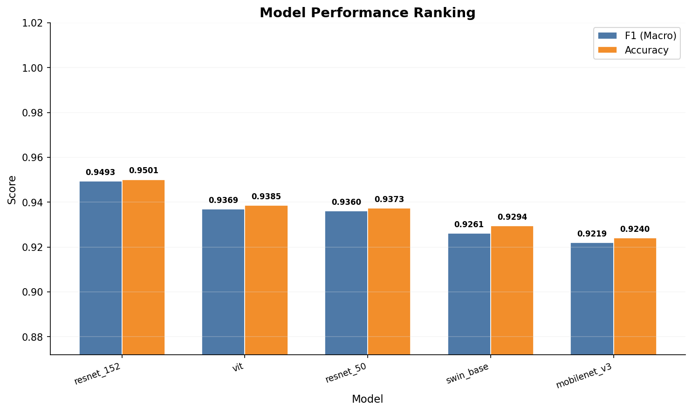
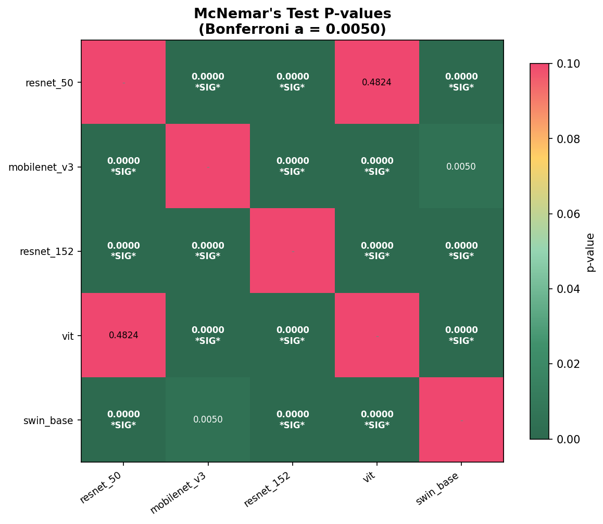
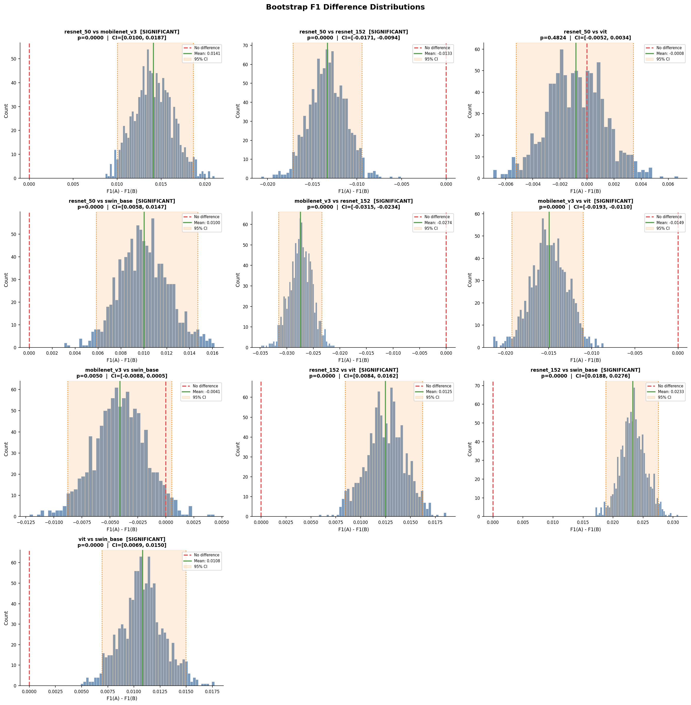

# 🌿 Crop Disease Detection — End-to-End ML Platform

[](https://crop-disease-detection-30ba1.web.app)
[](https://crop-disease-api-1049249498032.us-central1.run.app/docs)
[](.github/workflows/)
[](data/dvc/)

> **Live Demo:** [https://crop-disease-detection-30ba1.web.app](https://crop-disease-detection-30ba1.web.app)
>
> **API Docs:** [https://crop-disease-api-1049249498032.us-central1.run.app/docs](https://crop-disease-api-1049249498032.us-central1.run.app/docs)

## Business Objective

### Executive Problem Statement

Global agriculture faces massive challenges as plant diseases and pests threaten food security and crop yields. Traditional manual monitoring relies on farmers visually inspecting fields — a process that is labor-intensive, prone to human error, and often catches outbreaks too late.

### Project Goal

Develop a **deep learning-based image classifier** that analyzes plant leaf images to detect early signs of disease across **102 crop disease classes** and **20 plant species**, enabling timely, targeted interventions.

### Strategic Vision

Democratize expert agricultural knowledge by giving farmers instant, smartphone-accessible diagnostic capabilities with **explainable AI** (GradCAM heatmaps) and **multi-model comparison**.

### Key Performance Indicators

| Metric | Why It Matters |
|---|---|
| **Accuracy** | Overall correctness across all 102 disease classes |
| **Precision** | Minimize false positives — avoid unnecessary pesticide application |
| **Recall** ⭐ | **Most critical** — a false negative allows infection to spread |
| **F1-Score (macro)** | Balances Precision and Recall; treats all classes equally |

---

## Architecture

```
User Browser
    |
    v
Firebase Hosting (React Frontend)
    |  https://crop-disease-detection-30ba1.web.app
    v
Cloud Run (FastAPI + PyTorch Backend)
    |  https://crop-disease-api-1049249498032.us-central1.run.app
    v
Google Cloud Storage (Model Checkpoints)
    |  gs://crop-disease-detection-1/
    v
Trained Models (.pth files)
```

## Project Structure

```
crop_disease_detection/
│
├── api/                          # FastAPI backend
│   ├── main.py                   # FastAPI app with /health, /models, /predict, /explain
│   ├── inference.py              # Model loading, prediction, GradCAM
│   ├── Dockerfile                # Cloud Run container
│   ├── requirements.txt          # API dependencies
│   └── run_local.py              # Local dev server (port 8000)
│
├── frontend/                     # React web app
│   ├── src/
│   │   ├── App.jsx               # Main app with tabs, state, API polling
│   │   ├── api.js                # Axios client (Cloud Run URL)
│   │   └── components/
│   │       ├── ImageUpload.jsx   # Drag-and-drop upload
│   │       ├── ModelSelector.jsx # Model dropdown with F1 scores
│   │       ├── ResultsPanel.jsx  # Diagnosis + GradCAM display
│   │       ├── ComparePanel.jsx  # Side-by-side GradCAM comparison
│   │       └── Header.jsx        # App header
│   ├── vite.config.js            # Vite build config
│   └── package.json
│
├── configs/
│   └── label_mapping.json        # 102-class label mapping
│
├── data/
│   ├── dvc/                      # DVC metadata vault (Git-tracked .dvc recipes)
│   ├── processed/                # Renamed + organized images (DVC-tracked)
│   │   ├── combined_train/
│   │   └── combined_test/
│   ├── csv/                      # Generated manifests (DVC-tracked)
│   │   ├── train.csv
│   │   └── test.csv
│   └── original/                 # Raw source datasets (Git-ignored, not DVC-tracked)
│
├── notebook/
│   └── crop_disease_detection.ipynb  # EDA, model evaluation, PAC analysis
│
├── scripts/
│   ├── prepare_data.py           # Automated data prep (rename → CSV → label map)
│   ├── validate_data.py          # Lightweight data validation checks
│   ├── upload_to_gcs.py          # Upload datasets to GCS bucket
│   ├── submit_vertex_job.py      # Launch Vertex AI training
│   └── vertex_ai_training.py     # Cloud training script
│
├── src/
│   ├── dataset.py                # PyTorch Dataset from CSV manifests
│   ├── model.py                  # 8 model architectures (CNN, ResNet, ViT, etc.)
│   ├── augmentations.py          # GPU-accelerated torchvision v2 transforms
│   └── training/
│       └── trainer.py            # Training loop with checkpointing
│
├── configs/
│   └── label_mapping.json        # 102-class label mapping
│
├── tests/                        # Pytest suite for FastAPI backend
│
├── project_document/
│   └── documentation/            # Modular docs (INDEX.md + per-section guides)
│
├── .github/workflows/            # CI/CD: lint, test, build, deploy
│
├── dvc.yaml                      # DVC pipeline: data preparation stage
├── Makefile                      # Convenient targets: make prepare, train, deploy
├── .firebaserc                   # Firebase project alias
├── firebase.json                 # Firebase Hosting config
├── Dockerfile                    # Vertex AI training container
├── requirements.txt              # Python dependencies
└── README.md
```

---

## Technology Stack

| Component | Technology | Rationale |
|---|---|---|
| **Deep Learning** | PyTorch, torchvision | GPU acceleration, rich pre-trained model zoo |
| **Explainability** | pytorch-grad-cam | GradCAM heatmaps for model interpretability |
| **Backend** | FastAPI, Uvicorn | High-performance async API with auto-generated docs |
| **Frontend** | React 19, Vite 8, TailwindCSS 4 | Modern, fast, responsive UI |
| **Image Processing** | OpenCV, Pillow | Resize, normalize, color-space conversion |
| **Data Science** | NumPy, Pandas, scikit-learn | Metrics, splitting, classification reports |
| **Visualization** | Matplotlib, Seaborn | Training curves, confusion matrices |
| **Cloud Training** | Google Vertex AI | On-demand GPU (T4/V100/A100) |
| **Cloud Backend** | Google Cloud Run | Serverless, auto-scales to zero |
| **Cloud Frontend** | Firebase Hosting | Free static hosting with CDN |
| **Storage** | Google Cloud Storage | Dataset and model checkpoints |
| **Experiment Tracking** | TensorBoard + `torch.utils.tensorboard.SummaryWriter` | Per-fold loss, accuracy, F1, LR, confusion matrices; CV summary logging |
| **Data Versioning** | DVC + GCS | Reproducible datasets and model checkpoints |
| **CI/CD** | GitHub Actions | Automated test, build, deploy on push |
| **Dataset** | PlantVillage + plant_dataset_2 | 60,000+ labeled images, 102 classes, 20 plant species |

---

## Model Performance

All models trained with ImageNet pretrained weights + custom classification heads.

| Model | Type | Best Val F1 (macro) |
|---|---|---|
| CNN Baseline | Custom CNN | 0.8309 |
| ResNet-50 | Transfer Learning | 0.9360 |
| EfficientNet-B4 | Transfer Learning | 0.8942 |
| VGG-16 | Transfer Learning | 0.8708 |
| ViT (B/16) | Transfer Learning | 0.9177 |
| **ResNet-152** | Transfer Learning | **0.9519** ⭐ |
| MobileNet V3 | Transfer Learning | 0.9231 |
| Swin-Base | Transfer Learning | 0.9271 |

**Dataset:** 102 classes | 42,006 train | 19,167 test | 20 plant species

## Features

- **Multi-model inference** — select from 8 trained models
- **GradCAM explainability** — visual heatmaps showing model attention
- **Side-by-side comparison** — compare GradCAM across 2-3 models simultaneously
- **Cold-start handling** — frontend polls backend and shows loading state
- **Scale-to-zero backend** — Cloud Run costs minimized when idle
- **Rate limiting** — 30/min predict, 10/min explain
- **DVC data versioning** — datasets and models tracked with GCS remote
- **CI/CD pipeline** — GitHub Actions for automated test, build, and deploy

## API Endpoints

| Endpoint | Method | Description |
|---|---|---|
| `/health` | GET | Check if models are loaded |
| `/models` | GET | List available models with F1 scores |
| `/predict` | POST | Upload image + model → prediction + confidence |
| `/explain` | POST | Upload image + model → GradCAM heatmap (base64) |

See full API docs at: [https://crop-disease-api-1049249498032.us-central1.run.app/docs](https://crop-disease-api-1049249498032.us-central1.run.app/docs)

---

## Experiment Tracking with TensorBoard

Training logs are written automatically by `src/trainer.py` using `torch.utils.tensorboard.SummaryWriter`.

| Logged per fold | Logged per CV run | Logged for test set |
|---|---|---|
| `loss/train`, `loss/val` | `cv_mean/*`, `cv_std/*` | `test/loss`, `test/*_metrics` |
| `train/accuracy`, `val/accuracy` | — | `test/confusion_matrix` |
| `train/f1_macro`, `val/f1_macro` | — | `test/classification_report` |
| `learning_rate`, `weight_decay` | — | — |
| `confusion_matrix` (final) | — | — |
| `hyperparameters` (text) | — | — |

### View Vertex AI training logs (results/ folder)

All 8 models were trained on Vertex AI. Logs are organized by model:

```cmd
cd "c:\Users\sandi\Desktop\ML Working Folder\crop_disease_detection"
tensorboard --logdir results
```

Then open [http://localhost:6006](http://localhost:6006).

You’ll see a dropdown for each model: `cnn_baseline`, `efficientnet_b4`, `mobilenet_v3`, `resnet_152`, `resnet_50`, `swin_base`, `vgg_16`, `vit`.

> **Note:** Each model has `logs/fold_1/` (training curves) and `logs/test/` (final evaluation).

### View one model only

```cmd
tensorboard --logdir results\resnet_152\logs
```

### View local training logs

If you run `python scripts/local_training.py`:

```cmd
tensorboard --logdir runs\local
```

---

## Quick Start

### Use the Live App (No Setup)

1. Open [https://crop-disease-detection-30ba1.web.app](https://crop-disease-detection-30ba1.web.app)
2. Upload a leaf image
3. Select a model from the dropdown
4. Click **Predict** → get diagnosis + confidence
5. Click **Explain GradCAM** → see heatmap
6. Switch to **Compare Models** → compare 2-3 models side-by-side

> **Note:** First prediction after idle may take 30-60s (Cloud Run cold start).

### Local Development

#### Prerequisites
- Python 3.11+
- Node.js 18+
- `gcloud` CLI (for deployment)

#### Backend (FastAPI)
```cmd
cd api
python -m run_local
```
Swagger docs: [http://localhost:8000/docs](http://localhost:8000/docs)

Test endpoints:
```bash
curl http://localhost:8000/health
curl http://localhost:8000/models
curl -X POST http://localhost:8000/predict -F "image=@test.jpg" -F "model_name=resnet_152"
curl -X POST http://localhost:8000/explain -F "image=@test.jpg" -F "model_name=resnet_152"
```

#### Frontend (React)
```cmd
cd frontend
npm install
npm run dev
```
Open the URL Vite prints (usually `http://localhost:5173/`).

#### Deploy Frontend Updates
```cmd
cd frontend
npm run build
cd ..
firebase deploy
```

#### Deploy Backend Updates
```cmd
gcloud builds submit \
    --tag us-central1-docker.pkg.dev/crop-disease-detection-496608/crop-disease-api/crop-disease-api:latest \
    --dockerfile api/Dockerfile \
    --timeout=1800

gcloud run deploy crop-disease-api \
    --image us-central1-docker.pkg.dev/crop-disease-detection-496608/crop-disease-api/crop-disease-api:latest \
    --region us-central1
```

### Data Preparation (Automated)

```cmd
# One-command data prep: rename images → generate CSVs → build label mapping
make prepare

# Validate manifests and image paths
make validate
```

### DVC — Data & Model Versioning

All processed datasets, CSV manifests, and model checkpoints are tracked with DVC using a GCS remote:

```cmd
# Pull latest data / models
dvc pull

# Push after training a new fold
dvc add data/processed data/csv models/saved

dvc push
```

Remote configuration: `gs://crop-disease-detection-1/dvc_storage`

See `dvc.yaml` for the pipeline stage definition.


### Training on Vertex AI

```bash
# Submit training job
make train

# Or directly:
python scripts/submit_vertex_job.py --config configs/training_config.yaml
```

---

## Statistical Offline Evaluation (Hypothesis Testing)

When comparing machine learning models, looking only at overall test accuracy can be misleading. For instance, if Model A gets $93.8\%$ accuracy and Model B gets $93.7\%$, is Model A genuinely smarter, or did it just get lucky on a few images? 

To determine a scientific ranking, we performed a rigorous offline evaluation comparing 5 candidate models on our complete test set of **19,167 images** using two advanced statistical methods. Crucially, this evaluation runs directly on the checkpoints of **already trained models** without modifying their weights or retraining them.

### 🔬 The Methodology

#### 1. McNemar's Test (Granular Image-by-Image Comparison)
Fundamentally, this test evaluates **whether two models agree** on their classification decisions. Instead of comparing overall summary percentages, it does an **image-by-image comparison**. 
* For every single image in the 19,167 test set, it compares the models' predictions against the **true ground-truth labels** (the actual known diseases in the dataset). It records whether Model A's prediction matched the true label, and whether Model B's prediction matched the true label.
* It groups the results to see where the models **agree** (both matched the true label, or both failed) and where they **disagree** (one model matched the true label, while the other failed).
* **Null Hypothesis ($H_0$):** The models fundamentally agree, and their disagreements are symmetrical (i.e., if they disagree on 100 images, Model A matches the true label about 50 times and Model B matches it about 50 times). Any observed asymmetry is purely due to random chance.
* **Alternative Hypothesis ($H_1$):** The models do not agree, and their disagreements are severely asymmetrical (one model consistently matches the true label during disagreements while the other fails).
* By calculating the **p-value**, the test tells us whether the level of disagreement is statistically significant or if the models are essentially performing identically.

#### 2. Bonferroni Correction & Alpha Threshold
Normally in statistics, we look for a significance threshold (called **alpha** or $\alpha$) of $0.05$ (meaning there is less than a $5\%$ chance the result was due to luck). 
However, when comparing 5 models, we have to run **10 separate pairwise matches**. If we run many matches, the chance of finding a "fake" pattern by luck increases. To correct for this, we use the **Bonferroni Correction**:
$$\text{Corrected Alpha } (\alpha) = \frac{0.05}{10} = 0.0050$$
A model is only declared a statistical winner if the probability of its victory being a fluke is **less than $0.5\%$** ($p < 0.005$).

#### 3. Bootstrap Confidence Interval (Measuring Consistency)
How do we know a model's performance is stable across different subsets of data?
* We use **Bootstrap Resampling**: We randomly shuffle and rebuild our 19,167 test set **1,000 times** (allowing duplicate images) and recalculate the F1 score difference each time.
* This generates a distribution of F1 differences. We then find the range where $95\%$ of the trials land (the **95% Confidence Interval**).
* **The Rule:** If this interval contains `0` (e.g., the difference could be anywhere from $-0.5\%$ to $+0.3\%$), it means the models are statistically tied. If the interval excludes `0` completely, one model is a definitive winner.

---

### 🏆 Model Performance Summary & Rankings

Our evaluation revealed that **8 out of the 10 pairwise matches** were statistically significant:

1. **ResNet-152** ($F1=0.9493$, $Acc=0.9501$) — **The Absolute Champion**. It outperformed all other models and is statistically superior ($p < 10^{-12}$). The probability of its victory being due to luck is virtually zero.
2. **ViT (B/16)** ($F1=0.9369$) and **ResNet-50** ($F1=0.9360$) — **Statistically Equivalent** ($p = 0.4824$). Despite ViT having a slightly higher score, the image-by-image difference is too small to declare a scientific winner.
3. **Swin-Base** ($F1=0.9261$) and **MobileNet V3** ($F1=0.9219$) — **Statistically Equivalent** ($p = 0.00502$). While Swin-Base scored $0.42\%$ higher, it did not quite pass our strict corrected threshold of $0.0050$.

---

### 📈 Visualizations from the Full Test Run

#### 1. Performance Rankings
*This chart shows the macro F1-score and accuracy of all 5 candidate models side-by-side, sorted from best to worst.*


#### 2. Pairwise McNemar's Test Heatmap
*This heatmap displays the p-value for all 10 matchups. Green boxes indicate a statistically significant difference ($p < 0.005$), while red indicates a statistical tie.*


#### 3. Bootstrap F1-Difference Distributions
*These histograms show the F1-score differences over 1,000 bootstrap runs. Shaded yellow regions show the 95% Confidence Interval. Notice that for ties (like resnet_50 vs vit), the distribution overlaps with the red dashed line (zero difference).*


---

## License

This project is for educational and research purposes.
